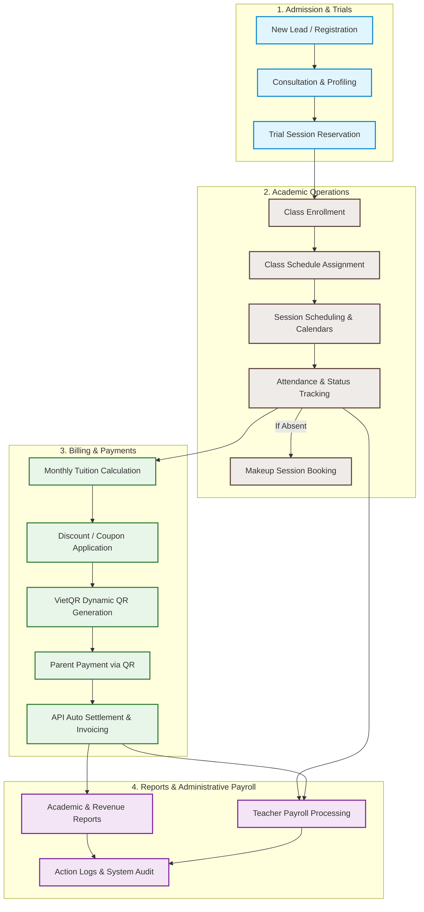

# Education Center Management System (ECMS)

[](https://opensource.org/licenses/MIT)
[](https://dotnet.microsoft.com/)
[](https://nextjs.org/)
[](https://react.dev/)

A modern, enterprise-grade Customer Relationship Management (CRM) and Management Information System (MIS) designed specifically for education centers, language schools, and training institutions. Built with a highly scalable **.NET Clean Architecture** backend and a responsive, interactive **Next.js & React** frontend.

---

## 🧭 Core Business Workflow

The system is designed not just for simple CRUD operations, but to model the real operational lifecycle of an educational institution:



---

## 🏛️ System Architecture

The project follows the **Clean Architecture** pattern to guarantee maintainability, testability, and independence from external frameworks:

```
[ Presentation (Web API) ]
           │
           ▼
[ Application (Use Cases, MediatR, DTOs) ]
           │
           ▼
[ Domain (Entities, Value Objects, Domain Events) ]
           ▲
           │
[ Infrastructure (EF Core, Database, External APIs) ]
```

*   **`EducationCenter.Crm.Domain`**: Core domain logic, Entities (`Class`, `Student`, `Attendance`, `TuitionInvoice`), Value Objects, and Domain Events.
*   **`EducationCenter.Crm.Application`**: CQRS queries/commands (via MediatR), validation logic (FluentValidation), mapping, and interface definitions.
*   **`EducationCenter.Crm.Infrastructure`**: Database contexts, configurations, migrations, repository patterns, security, and integration services (e.g., Google Calendar, Email notifications).
*   **`EducationCenter.Crm.Api`**: RESTful API Controllers, middleware, authentication (JWT), and application configuration.
*   **`frontend`**: Next.js App Router workspace utilizing TypeScript, React hooks, and Tailwind CSS.

---

## 📊 Database Schema (Entity Relationship Diagram)

Below is the logical database design showing relationships between core domains: Identity, Academic, Admissions, and Finance.

```mermaid
erDiagram
    %% Identity Domain
    User ||--o{ UserRole : holds
    Role ||--o{ UserRole : assigns
    Role ||--o{ RolePermission : details
    Permission ||--o{ RolePermission : binds

    %% Admissions Domain
    Lead ||--o{ TrialSession : schedules
    Lead ||--o{ ParentCareLog : tracks

    %% Academic Domain
    Room ||--o{ Class : hosts
    Teacher ||--o{ Class : teaches
    Class ||--o{ Student : contains
    Class ||--o{ ClassSchedule : plans
    Class ||--o{ ScheduleOccurrence : schedules
    ClassSchedule ||--o{ ScheduleOccurrence : generates
    
    Student ||--o{ StudentParent : links
    Parent ||--o{ StudentParent : links

    ScheduleOccurrence ||--o{ Attendance : marks
    Student ||--o{ Attendance : logs

    ScheduleOccurrence ||--o{ IndividualMakeup : hosts
    Student ||--o{ IndividualMakeup : books

    %% Financial Domain
    Student ||--o{ TuitionInvoice : pays
    Class ||--o{ TuitionInvoice : charges
    DiscountCode ||--o{ TuitionInvoice : applies
    PaymentSetting ||--o{ TuitionInvoice : references

    %% Core Entities Fields Definition
    User {
        string Id PK
        string Username
        string Email
        string PasswordHash
        boolean IsActive
    }
    Student {
        string Id PK
        string FullName
        date DateOfBirth
        string Status
    }
    Parent {
        string Id PK
        string FullName
        string PhoneNumber
        string Email
    }
    Class {
        string Id PK
        string ClassName
        string TeacherId FK
        string RoomId FK
        decimal MonthlyFee
        string Status
    }
    ScheduleOccurrence {
        string Id PK
        string ClassId FK
        datetime StartTime
        datetime EndTime
        string Status
    }
    TuitionInvoice {
        string Id PK
        string StudentId FK
        string ClassId FK
        decimal TotalAmount
        string PaymentStatus
        string QrCodeContent
    }
```

---

## 🛠️ Tech Stack

### Backend
*   **Framework:** .NET Core (C#)
*   **Database Access:** Entity Framework Core
*   **Messaging & Command Handling:** MediatR (CQRS Pattern)
*   **Validation:** FluentValidation
*   **Realtime Notifications:** SignalR
*   **API Documentation:** Swagger / OpenAPI

### Frontend
*   **Framework:** Next.js (React)
*   **Language:** TypeScript
*   **Styles:** TailwindCSS
*   **Testing:** Vitest

---

## 🚀 Getting Started

### Prerequisites
*   [.NET SDK](https://dotnet.microsoft.com/download) (Version 8.0 or higher)
*   [Node.js](https://nodejs.org/) (Version 18.0 or higher)
*   SQL Server or equivalent database engine.

### 1. Database Setup & Backend Initialization
1.  Navigate to the API project folder:
    ```bash
    cd src/EducationCenter.Crm.Api
    ```
2.  Update the database connection string in `appsettings.json` under `ConnectionStrings:DefaultConnection`.
3.  Apply migrations and update database schema:
    ```bash
    dotnet ef database update
    ```
4.  Run the backend server:
    ```bash
    dotnet run
    ```
    The Swagger documentation will be available at `http://localhost:5000/swagger`.

### 2. Frontend Initialization
1.  Navigate to the frontend folder:
    ```bash
    cd frontend
    ```
2.  Install dependencies:
    ```bash
    npm install
    ```
3.  Configure environmental variables. Copy `.env.example` to `.env.local` and configure your API URL:
    ```bash
    NEXT_PUBLIC_API_URL=http://localhost:5000/api
    ```
4.  Run the local development server:
    ```bash
    npm run dev
    ```
    Open `http://localhost:3000` to view the application.

---

## 🧪 Testing

### Backend Unit & Integration Tests
To run C# test suites:
```bash
dotnet test
```

### Frontend Tests
To run unit and component tests via Vitest:
```bash
cd frontend
npm run test
```

---

## 📄 License & Copyright

Copyright © 2026 Hungle2910. All rights reserved.

Licensed under the [MIT License](LICENSE) - see the [LICENSE](LICENSE) file for details.
