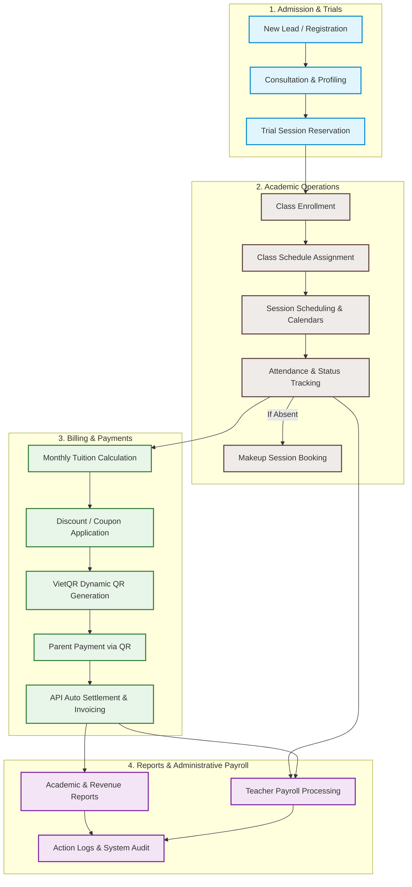
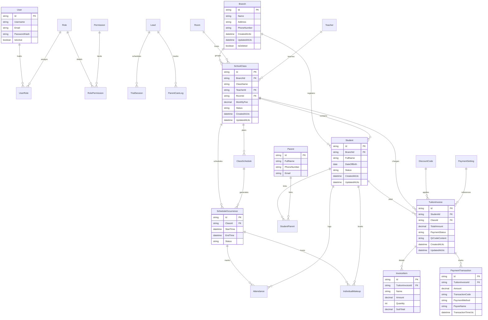

# Education Center Management System (ECMS)

[](https://opensource.org/licenses/MIT)
[](https://dotnet.microsoft.com/)
[](https://nextjs.org/)
[](https://react.dev/)

A modern, enterprise-grade Customer Relationship Management (CRM) and Management Information System (MIS) designed specifically for education centers, language schools, and training institutions. Built with a highly scalable **.NET Clean Architecture** backend and a responsive, interactive **Next.js & React** frontend.

---

## 🎯 Project Goals, Audience & Features / Mục tiêu, Đối tượng & Tính năng

### 🇺🇸 English Version

#### 1. Purpose & Goals
The **Education Center Management System (ECMS)** is built to centralize and automate the complex operational lifecycle of modern educational institutions. It replaces disjointed spreadsheets and manual tracking with a unified data-driven flow, ensuring administrative consistency and operational agility.

#### 2. Key Problems Solved & Target Audience
*   **For Administrators & Staff (Operations & Finance):**
    *   *Problem:* Manual tuition calculation, class scheduler conflicts, and tedious teacher payroll preparation.
    *   *Solution:* Automatic monthly tuition billing, real-time scheduler conflict checks, and automated class-duration-based teacher payroll reports.
*   **For Teachers (Academic Operations):**
    *   *Problem:* Clunky paper attendance logs and unscheduled makeup classes leading to confusion.
    *   *Solution:* A dedicated dashboard for mobile-first attendance, automated tracking of eligible absent students, and streamlined makeup class registration.
*   **For Parents & Students (Engagement & Finance):**
    *   *Problem:* Out-of-date schedules and friction in paying tuition.
    *   *Solution:* Live schedule calendar with realtime notifications and dynamic **VietQR** generation for auto-settled payments.
*   **For Developers & AI Assistance (Extensibility):**
    *   *Problem:* Hard-to-query databases for administrators who aren't technical.
    *   *Solution:* Integrated **Model Context Protocol (MCP)** allowing developers and AI agents to safely query and manage CRM records via natural language commands.

#### 3. Core Features
*   **Admission & Trial Workflow:** Lead acquisition, consultation profiling, and trial session management.
*   **Conflict-Free Academic Scheduler:** Automated class occurrence generation, schedule calendar grids, and smart conflict checks.
*   **Smart Attendance & Makeup System:** Real-time attendance tracking, automatic calculation of absent sessions, and makeup class assignment.
*   **Automated Finance & VietQR:** Dynamic QR billing with auto-settlement, parent invoicing, and automatic receipt generation.
*   **Real-time Alerts:** Powered by **SignalR** for instant operational alerts, notifications, and updates.

---

### 🇻🇳 Bản tiếng Việt

#### 1. Mục đích & Mục tiêu dự án
**Education Center Management System (ECMS)** ra đời nhằm tối ưu hóa và tự động hóa toàn bộ vòng đời vận hành phức tạp của các trung tâm giáo dục, trường ngoại ngữ và các cơ sở đào tạo. Hệ thống thay thế các bảng tính Excel rời rạc bằng một quy trình dữ liệu tập trung, nhất quán, hỗ trợ đắc lực cho công tác quản trị.

#### 2. Vấn đề giải quyết & Đối tượng hướng tới
*   **Đối với Ban quản lý & Nhân viên (Vận hành & Tài chính):**
    *   *Vấn đề:* Mất nhiều thời gian tính học phí định kỳ, xếp lịch trùng lặp và tính lương giáo viên thủ công.
    *   *Giải pháp:* Tự động hóa tính phí hàng tháng, hệ thống kiểm tra xung đột phòng/giáo viên realtime, và lập bảng lương tự động dựa trên số giờ dạy thực tế.
*   **Đối với Giáo viên (Giảng dạy & Học thuật):**
    *   *Vấn đề:* Ghi nhận điểm danh bằng sổ tay bất tiện, quản lý học bù không có hệ thống dẫn đến sót học viên.
    *   *Giải pháp:* Trang điểm danh trực tuyến giao diện mobile-first, tự động lọc danh sách học viên vắng đủ điều kiện học bù, và duyệt lịch học bù tự động.
*   **Đối với Phụ huynh & Học sinh (Kết nối & Học phí):**
    *   *Vấn đề:* Khó theo dõi lịch học mới nhất, thủ tục đóng tiền mặt phức tạp.
    *   *Giải pháp:* Lịch học realtime đồng bộ, nhận thông báo tức thời, và tự động tạo mã **VietQR** kèm số tiền/nội dung động giúp quét mã thanh toán gạch nợ tức thì.
*   **Đối với Lập trình viên & Trợ lý AI (Mở rộng):**
    *   *Vấn đề:* Khó khăn trong việc truy vấn nhanh báo cáo vận hành nếu không biết viết SQL.
    *   *Giải pháp:* Tích hợp cổng giao thức **MCP (Model Context Protocol)** giúp nhà phát triển và trợ lý AI giao tiếp trực tiếp với database để truy vấn/thao tác dữ liệu bằng ngôn ngữ tự nhiên.

#### 3. Các tính năng cốt lõi
*   **Quản lý tuyển sinh & Học thử:** Tiếp nhận leads, phân loại tư vấn, xếp lịch học thử.
*   **Xếp lịch học không xung đột:** Tự động tạo chuỗi ca học, kiểm tra tài nguyên lớp/phòng/giáo viên, lịch trực quan.
*   **Điểm danh & Học bù thông minh:** Ghi nhận chuyên cần, tính số buổi vắng và xử lý quy trình học bù khép kín.
*   **Tài chính & Thanh toán tự động:** Lập hóa đơn học phí tự động, quét VietQR thanh toán tự gạch nợ.
*   **Thông báo realtime:** Sử dụng công nghệ **SignalR** gửi thông báo hoạt động tức thời đến đúng đối tượng.

---

## 🧭 Core Business Workflow

The system is designed not just for simple CRUD operations, but to model the real operational lifecycle of an educational institution:



---

## 🏛️ System Architecture

The project follows the **Clean Architecture** pattern to guarantee maintainability, testability, and independence from external frameworks:

```
[ Presentation (Web API) ]
           │
           ▼
[ Application (Use Cases, MediatR, DTOs) ]
           │
           ▼
[ Domain (Entities, Value Objects, Domain Events) ]
           ▲
           │
[ Infrastructure (EF Core, Database, External APIs) ]
```

*   **`EducationCenter.Crm.Domain`**: Core domain logic, Entities (`Class`, `Student`, `Attendance`, `TuitionInvoice`), Value Objects, and Domain Events.
*   **`EducationCenter.Crm.Application`**: CQRS queries/commands (via MediatR), validation logic (FluentValidation), mapping, and interface definitions.
*   **`EducationCenter.Crm.Infrastructure`**: Database contexts, configurations, migrations, repository patterns, security, and integration services (e.g., Google Calendar, Email notifications).
*   **`EducationCenter.Crm.Api`**: RESTful API Controllers, middleware, authentication (JWT), and application configuration.
*   **`EducationCenter.Crm.McpServer`**: Model Context Protocol (MCP) Server implementing JSON-RPC 2.0 stdio transport to expose CRM operations to AI coding agents.
*   **`frontend`**: Next.js App Router workspace utilizing TypeScript, React hooks, and Tailwind CSS.

---

## 📊 Database Schema (Entity Relationship Diagram)

Below is the logical database design showing relationships between core domains: Identity, Academic, Admissions, and Finance.



---

## 🛠️ Tech Stack

### Backend
*   **Framework:** .NET Core (C#)
*   **Database Access:** Entity Framework Core
*   **Messaging & Command Handling:** MediatR (CQRS Pattern)
*   **Validation:** FluentValidation
*   **Realtime Notifications:** SignalR
*   **API Documentation:** Swagger / OpenAPI

### Frontend
*   **Framework:** Next.js (React)
*   **Language:** TypeScript
*   **Styles:** TailwindCSS
*   **Testing:** Vitest

---

## 🤖 Model Context Protocol (MCP) Server

The project includes an **MCP Server** (`EducationCenter.Crm.McpServer`) implemented in C# that runs over standard input/output (`stdio`). This allows AI assistants (like Claude Desktop or Antigravity IDE) to interact directly with the CRM database to query students, check schedules, and inspect attendance records.

### Exposing Tools
- `list_students`: Queries the student directory.
- `list_classes`: Fetches all classes.
- `list_teachers`: Fetches all teachers.
- `list_schedules`: Fetches class schedules within a specified date range.
- `get_attendance`: Queries occurrence-based attendance by ID.

### Running & Deploying
To compile and publish the MCP Server as a standalone executable:
```bash
dotnet publish src/EducationCenter.Crm.McpServer/EducationCenter.Crm.McpServer.csproj -c Release -r win-x64 --self-contained
```
This generates a compiled binary at `src/EducationCenter.Crm.McpServer/bin/Release/net10.0/win-x64/publish/EducationCenter.Crm.McpServer.exe` which can be registered in your AI client's configuration file (`mcp_config.json` or `claude_desktop_config.json`).

---

## 🚀 Getting Started

### Prerequisites
*   [.NET SDK](https://dotnet.microsoft.com/download) (Version 8.0 or higher)
*   [Node.js](https://nodejs.org/) (Version 18.0 or higher)
*   SQL Server or equivalent database engine.

### 1. Database Setup & Backend Initialization
1.  Navigate to the API project folder:
    ```bash
    cd src/EducationCenter.Crm.Api
    ```
2.  Update the database connection string in `appsettings.json` under `ConnectionStrings:DefaultConnection`.
3.  Apply migrations and update database schema:
    ```bash
    dotnet ef database update
    ```
4.  Run the backend server:
    ```bash
    dotnet run
    ```
    The Swagger documentation will be available at `http://localhost:5000/swagger`.

### 2. Frontend Initialization
1.  Navigate to the frontend folder:
    ```bash
    cd frontend
    ```
2.  Install dependencies:
    ```bash
    npm install
    ```
3.  Configure environmental variables. Copy `.env.example` to `.env.local` and configure your API URL:
    ```bash
    NEXT_PUBLIC_API_URL=http://localhost:5000/api
    ```
4.  Run the local development server:
    ```bash
    npm run dev
    ```
    Open `http://localhost:3000` to view the application.

---

## 🧪 Testing

### Backend Unit & Integration Tests
To run C# test suites:
```bash
dotnet test
```

### Frontend Tests
To run unit and component tests via Vitest:
```bash
cd frontend
npm run test
```

---

## 📄 License & Copyright

Copyright © 2026 Hungle2910. All rights reserved.

Licensed under the [MIT License](LICENSE) - see the [LICENSE](LICENSE) file for details.
